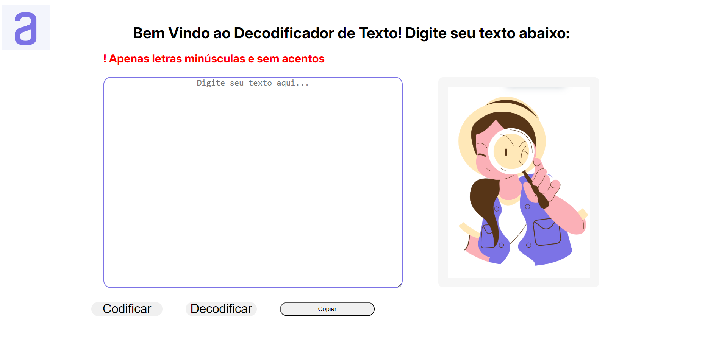

# decodificadordetexto
Desafio proposto pela Alura em parceria com o programa da Oracle 'One Br' #oraclenexteducation

Ferramentas utilizadas:
- HTML;
- CSS;
- JavaScript;
- Canvas.

Desenvolvido por:
Ana Ruth Soares de Araújo

